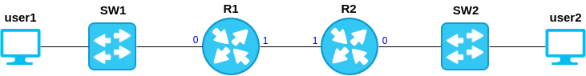

.. _topology:

Topology
========

When you create or open a project, you can modify the topology
with the command ``edit``.
An empty topology looks like that :

.. code-block:: ini

    [config]
    image_dir = images
    config_dir = configs

    [nodes]

    [switches]

    [bridges]

The content of each section is explained below.

Nodes
-----

In the section ``[nodes]``, you can add host/router in the topology.
At minimum, each node is identified by :

  1. a name
  2. a type
  3. a number of interface and for each interface,

These 3 information are declared like that :

.. code-block:: ini

    [nodes]
    [[host_name]]
    type = host_type
    if_numbers = 1
    if0 = remote_peer

3 main types of node are available in pynetem :

  1. docker node
  2. qemu node
  3. junos node

Docker node
```````````
A docker node is a docker container launch by pynetem based on 3 images :
  - rca/host identified by the type *docker.host*,
    which emulates a terminal node
  - rca/frr identified by the type *docker.frr*, which emulates router
    based on the software `FRR <https://frrouting.org/>`_
  - rca/quagga identified by the type *docker.quagga*, which emulates router
    based on the software `Quagga <https://www.quagga.net/>`_

When possible, this is the preferred way to emulate node/router.

Qemu node
```````````
A qemu node is a qemu instance launch by pynetem. To add a qemu node in
the topology, the *type* parameter has to respect this form:

  * ``qemu.<image_name>`` where *<image_name>" is a name of a qemu image
    available in the folder designated by the config argument *image_dir*

Moreover, qemu node requires more argument than docker one:

  * ``console`` (required): the port number used to access to this instance
    through telnet. It must be unique
  * ``memory`` (optional): specify this parameter (as a number, the unit is M)
    if you want to override the default value of memory allocated
    for a qemu instance.

Example
"""""""
If you configure *image_dir* equal to ``/opt/pynetem`` and a qemu image
is located at ``/opt/pynetem/stretch.img``, then you can add a qemu node
in the topology with the following lines:

.. code-block:: ini

    [nodes]
    [[host1]]
    type = qemu.stretch
    console = 2001
    memory = 256
    if_numbers = 1
    if0 = remote_peer

Junos node
```````````
Junos node is a specific qemu node used to launch Juniper JunOS olive image.
To use it, you have to get a JunOS olive image located in the *image_dir*
folder and naming ``junos-<version>.img``, with a specific configuration:

  * Password set to ``Juniper`` for user root
  * Hostname set to ``generic``

Then you can declare a JunOS if you
specify the type ``junos.<version>``. The other argument is identical to
a qemu node.

The main difference between an qemu and junos node concern the way
the state of the node is saved/loaded. For a junos node, only the
juniper configuration is saved as plain text in the project archive
(instead of complete img of the disk, like other qemu nodes), thanks
to a telnet connection.


Connections
```````````
All links between 2 nodes or between a node and a switch/bridge is declared
in the node section of the topology. To do that, 2 parameters are used:

  * ``if_numbers``: define the number of interfaces for this node
  * ``if<num>``: define the connection for the interface *<num>*.
    The possible values are:

      * ``__null__``: the interface is not connected
      * ``<node_name>.<if_number>``: the interface is connected to the if
        *<if_number>* of the node *<node_name>*
      * ``sw.<sw_name>``: the interface is connected to the switch *<sw_name*
      * ``br.<br_name>``: the interface is connected to the bridge *<br_name*

Switches
--------
In the ``[switches]``, you can add some switches to the topology. 2 types of
switch are available :

  - `VDE <https://github.com/virtualsquare/vde-2>`_ which works only with
    qemu or junos node
  - `OpenVSwitch <https://www.openvswitch.org/>`_ which works with all kind of
    nodes and thus are the preferred solution.

A switch is declared like that:

.. code-block:: ini

    [switches]
    [[switch_name]]
    type = vde|ovs

An OpenVSwitch switch take no argument. On the other side, a VDE switch takes
1 argument:

  * ``tap`` (boolean, required): set to yes if you want add a tap interface
    named *VDE<sw_name>* connected to the switch. It can be useful
    if you want to capture traffic on that switch.


Bridges
-------
In the ``[bridges]``, you can add some bridges to the topology.
A bridge should be declared if you want to communicate with the host network.
A bridge takes only 1 argument:

  * ``host_if`` (string, required): the name of the host interface that will
    be connected to that bridge

Example
```````
.. code-block:: ini

    [bridges]
    [[bridge_name]]
    host_if = eth0


Full example
------------



Below, you will find topology file to create the network above, based on docker
nodes and ovs switches:


.. code-block:: ini

    [config]
    image_dir = images
    config_dir = configs

    [nodes]
    [[user1]]
    type = docker.host
    if_numbers = 1
    if0 = sw.SW1
    [[user2]]
    type = docker.host
    if_numbers = 1
    if0 = sw.SW2

    [[R1]]
    type = docker.frr
    if_numbers = 2
    if0 = sw.SW1
    if1 = R2.1
    [[R2]]
    type = docker.frr
    if_numbers = 2
    if0 = sw.SW2
    if1 = R1.1

    [switches]
    [[SW1]]
    type = ovs
    [[SW2]]
    type = ovs

    [bridges]
